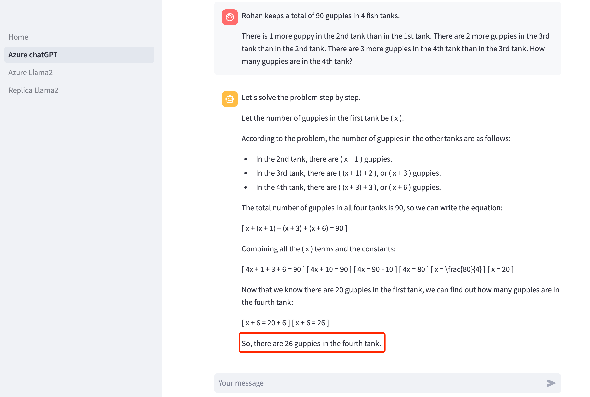

# Using Streamlit to build chat robots with LLMs — the fastest way!

My personal experience when using Streamlit to build a quick demo app for comparing results from ChatGPT, Llama2

Date: Feb 9th 2024

# 1. Streamlit Intro

[Streamlit](https://www.streamlit.io/) is an **open-source** **Python library** that makes it easy to create and share **beautiful, custom web apps** for machine learning and data science. In **just a few minutes** you can build and deploy powerful data apps.

## 1.1 Why Streamlit

### 1.1.1 Benefits

- **Front-end encapsulation.** Provide automatic standard\user-friendly widget without being burdened with the CSS/JS skills
- **Real-time Rendering**. with `streamlit run` , it’s easy to render the front-end effects whenever you modify and save the source code.
- **Easy to deploy**. Provide a free community cloud that enables Apps to deploy.

### 1.1.2 Concepts

- **Useful Widget**.
    - st.write()  automatically identify the content format.
    - diagram. st.line_chart(), st.map()
    - st.selectbox(), st.slider()
- **Unique features.**
    - **Caching**.
        
        
        
    - **Session State.**
        - Caching associates stored values to specific functions and inputs. Cached values are accessible to all users across all sessions.
        - Session State associates stored values to keys (strings). Values in session state are only available in the single session where it was saved.
    - **Multi pages.**
    
    ```python
    Home.py # This is the file you run with "streamlit run"
    └─── pages/
      └─── page1.py # This is a page
      └─── page2.py # This is another page
      └─── page3.py # So is this
    ```
    

### 1.1.3 Summary


---

## 1.2 Development workflow

1. **Installation**
    
    ```python
    pip install streamlit
    ```
    
2. **Coding & Test**
    1. create a Python file (xx.py) in IDE
    2. import streamlit
    
    ```python
    import streamlit as st
    
    st.write("Hello World")
    ```
    
    c. setup environment
    
    
    
    d. Run xx.py 
    
    ```python
    streamlit run app.py
    ```
    
    e. check result in browser. typically `http://localhost:8501`.
    
3. **Deployment**
    1. Login on streamlit website, easy to deploy with just one click.

---

# 2. Best Practice

### 2.1 Building an web app within half a day! 🎉

view my project 😊: **[AI4Kids Prototype](https://swing-ai-ai4kids.streamlit.app/)**

- chatGPT: using Azure AI studio to get endpoint & secret_key
- Llama2:
    - Replica: using replica to host Llama2 API. need to use the SECRET_KEY of Replica platform
    - Azure: using Azure AI studio to get url & secret_key

### evaluation 👀

problem: 

Rohan keeps a total of 90 guppies in 4 fish tanks.

- There is 1 more guppy in the 2nd tank than in the 1st tank.
- There are 2 more guppies in the 3rd tank than in the 2nd tank.
- There are 3 more guppies in the 4th tank than in the 3rd tank.

How many guppies are in the 4th tank?


result comparison:

 chatGPT-4



Llama2-70B


Llama2-7B


---

### 2.2 Problems I met 😢

1. **Secrete Management.**
    1. Streamlit provide a local secrete management. KEY stores in a secrets.toml file
    2. the file need to be in the same path with the [home.py](http://home.py) (the running script)
    
    ```python
    api_key =  st.secrets['AZURE_API_KEY']
    ```
    

1. **Session Conflict**


- session_state is a global variable, need to name differently in different page

1. **Sample code issue.** (sometimes will be out-of-date)
    
    3.1 Sample code with Azure playground. **.base_url**, not **.api_base**
    


3.2 Azure AI with Llama2 is not user-friendly using request/ respond. would be better if can encapsulate a function to format the input and output. 


need to format the result as following:

```python
response = urllib.request.urlopen(req)
result = response.read()
jsonResponse = json.loads(result.decode('utf-8'))
k1 = jsonResponse['choices'][0]
msg = k1['message']['content']
```

1. **Deployment dependencies**
    - remember to add a file: requirements.txt in the projects, especially for third-party packages, so that when deploy on the community cloud, it can read the dependencies, or will running failed.
    
    
    
    - edit Secret key in settings
    
    
    

---

### **2.3 Further Optimization:**

1. User input need to upgrade from text to image/text input
2. add more LLMs to the console (Gemini, etc)
3. upgrade the UI/UX to collect human feedback
4. Prompt optimization for math tutoring